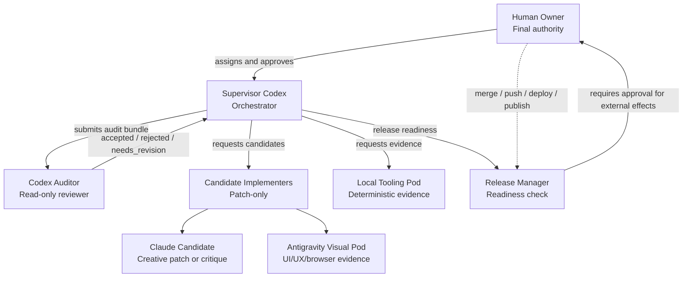
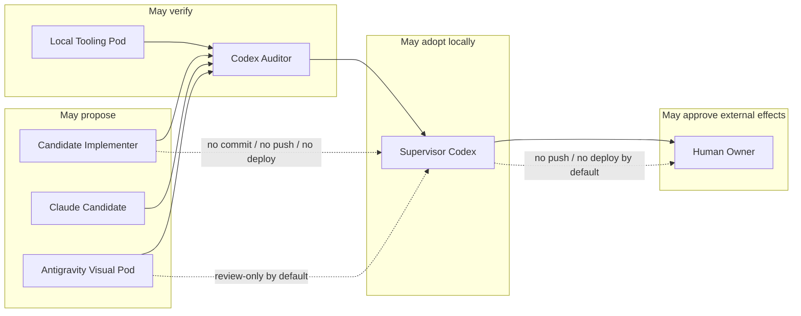
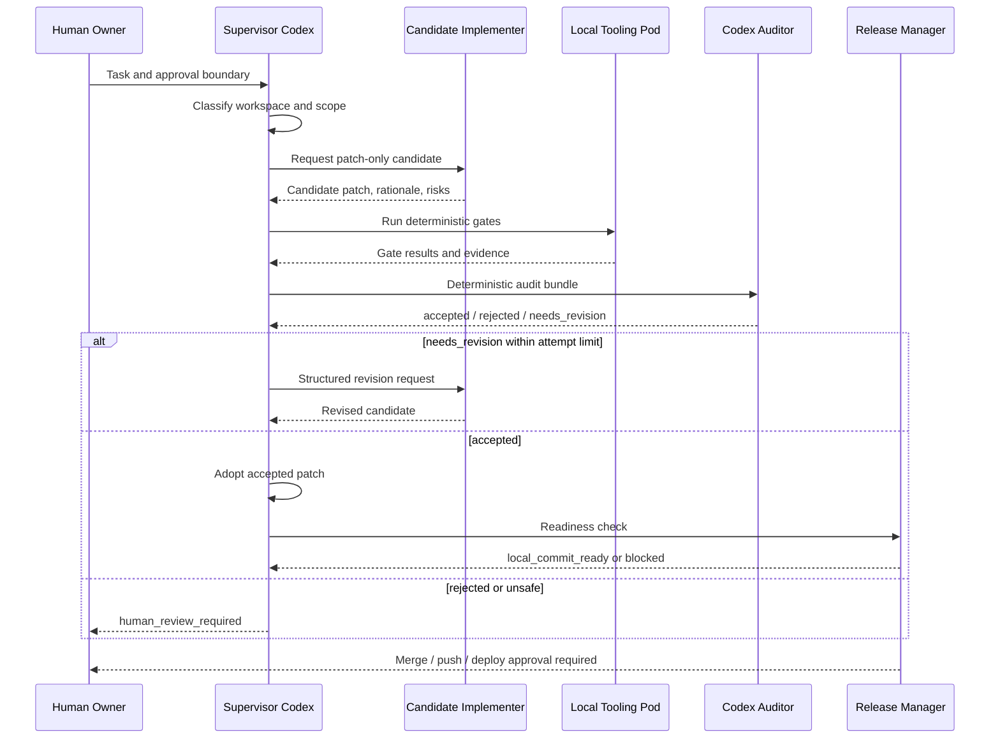

# AI Agent Organization Bootstrap

This repository is public. Committed content, Issues, Pull Requests, and Discussions must be sanitized by design.

## What this is

This repository contains a governance bootstrap for AI-assisted software development. It is not an application framework and not a prompt collection.

It is a bounded operating contract for Supervisor Codex, Claude candidate implementers, Codex Auditor, Antigravity Visual Pod, Local Tooling, and Human Owner.

## Start here

Before using this bootstrap, classify the workspace first.

| Workspace state | Required first action |
|---|---|
| New project | Use a fresh local-only workspace. |
| Existing repo | Require a clean tracked working tree before writing. |
| Dirty repo | Stop before writing anything. |
| Ambiguous workspace | Stop unless files resolve the ambiguity safely. |
| OneDrive / Dropbox / iCloud / Google Drive / similar sync path | Do not write without explicit approval. |

## Normative source

This README is an overview. The normative execution contract is `bootstrap/ai-org-bootstrap-v0.4.md`.

If this README conflicts with the bootstrap document, the bootstrap document wins.

## Public repository warning

Do not paste the following into commits, Issues, Pull Requests, or Discussions:

- secrets, credentials, tokens, webhook URLs, or private keys
- raw prompts, transcripts, stdout, or stderr
- local absolute paths or local machine details
- screenshots or recordings containing private data
- production personal data or customer data
- unredacted candidate artifacts or invocation manifests

## Design philosophy

Do not maximize generation blindly. Minimize authority before writes.

The contract classifies the workspace first, separates implementation, audit, adoption, and release authority, treats raw artifacts as risky, and prefers deterministic gates before LLM judgment.

## Why this exists

LLMs are capable, but overbroad by default.

Branches alone do not prevent inheritance of dirty worktrees or old project state. Cloud-sync paths can expose raw logs and local metadata. Candidate patches need audit bundles, base SHA identity, and bounded revision loops.

## Core contracts

- No writes before workspace classification.
- New projects use isolated local-only workspaces.
- Dirty existing repos are hard stops.
- Cloud-synced workspaces require explicit approval before writes.
- `.agent-runs/` is ignored raw runtime material.
- Committed history uses sanitized summaries only.
- Bootstrap self-audit is limited to mechanical governance scope.

## Approval phrases

These actions require explicit human approval.

| Action | Required approval |
|---|---|
| Write in a cloud-synced workspace | `APPROVE CLOUD-SYNC WORKSPACE <run_id>` |
| Merge into a protected branch | `APPROVE MERGE <run_id> <target_branch>` |
| Let Antigravity produce a candidate UI patch | `APPROVE ANTIGRAVITY CANDIDATE UI PATCH <run_id>` |
| Push, deploy, or publish | Separate explicit human approval |

## Roles

- Human Owner: controls merge, push, deploy, publish, production data, credentials, and legal, privacy, and brand decisions.
- Supervisor Codex: routes tasks, adopts accepted patches, verifies work, maintains governance, and creates allowed local commits. It does not deploy.
- Codex Auditor: independent read-only reviewer for scope, policy, diff, evidence, base SHA, target ownership, and high-risk changes. It cannot be the implementer.
- Candidate Implementer: produces patch-only candidates in an isolated branch or worktree.
- Claude: optional candidate implementer, reviewer, or spec critic only when explicitly approved.
- Antigravity Visual Pod: UI, UX, graphic, and browser review specialist. Default mode is review-only and artifact-first.
- Local Tooling Pod: generates deterministic evidence. It does not make release or audit decisions.

## Team roster

Characterization is a memory aid, not an authority grant.

The normative authority boundaries remain in `bootstrap/ai-org-bootstrap-v0.4.md` and `.agent-org/policies/`.

### Human Owner

The final accountable owner. Controls high-risk decisions, merge, push, deploy, publish, production data, credentials, legal, privacy, license, and brand decisions.

Character:

- The accountable principal
- The final gate
- The only actor allowed to approve irreversible external effects

### Supervisor Codex

The field supervisor and orchestrator. Routes tasks, selects staff, adopts accepted patches, verifies work, and creates allowed local commits. It coordinates candidate generation, audit, and adoption as separate steps.

Character:

- The conductor
- The scope keeper
- The patch adopter, not the unchecked author

### Codex Auditor

An independent read-only auditor. Compares the original task, diff, checks, candidate outputs, and audit bundle. Rejects scope drift, policy violations, missing evidence, and suspicious changes. It must not be the implementer.

Character:

- The skeptical reviewer
- The separation-of-duties guard
- The one that asks for evidence

### Candidate Implementer

A patch-only candidate producer. Works in an isolated branch or worktree, but does not commit, merge, push, or deploy. Its output is a patch plus rationale, checks, assumptions, and known risks for audit.

Character:

- The draftsperson
- The replaceable specialist
- The proposer, not the decider

### Claude Candidate

An optional candidate implementer or critic used only with explicit approval. It can serve as spec critic, risk reviewer, copy reviewer, or patch candidate. It must not write directly to the main worktree, and its output is subject to Codex Auditor review.

Character:

- The creative challenger
- The alternative patch generator
- The useful outsider kept behind a gate

### Antigravity Visual Pod

The specialist pod for UI, UX, graphics, and browser verification. Default mode is review-only and artifact-first. It may produce visual notes and candidate UI patches only with explicit approval. It does not get backend, auth, database, billing, deploy, commit, merge, push, or production-data authority by default.

Character:

- The visual inspector
- The browser witness
- The designer-eye without release authority

### Local Tooling Pod

The deterministic evidence generator. Runs status checks, diffs, apply checks, sanitation scans, lint, tests, and similar checks. It produces evidence, but does not make release or audit decisions.

Character:

- The instrument panel
- The evidence machine
- The source of facts, not judgment

### Release Manager

The final consistency checker for local commit readiness, merge readiness, and release readiness. It evaluates readiness, but does not push, deploy, or publish without explicit Human Owner approval.

Character:

- The shipping checklist
- The last internal gate
- The line between local readiness and external release

### Gemini

A future optional cross-model reviewer, multimodal critic, or QA candidate. It is used only with explicit approval and is not executed or configured during bootstrap.

Character:

- The optional second opinion
- The future multimodal reviewer
- The reserve specialist

### Local AI

A non-adopted scratch assistant. It must not be used for formal audit, summary, classification, or release judgment. If used later, it is scratch-only unless separately governed.

Character:

- The sandbox thinker
- The non-authoritative scratchpad
- The idea source that does not cascade

## Team topology

## Authority boundaries

## Candidate patch governance

Candidate patches are governed by a candidate objective, target branch or worktree ownership, `candidate_base_sha`, and `current_target_sha` revalidation.

By default, automatic candidate attempts are capped at 3 per `run_id` and `candidate_objective_id`. Switching agents does not reset the counter.

Auditor findings are structured. `needs_revision` loops are bounded. Candidate base and current target SHA are reread before audit and adoption.

## Antigravity Visual Pod

Antigravity Visual Pod is a UI, UX, graphic, and browser review specialist.

Its default mode is review-only and artifact-first. Candidate UI patches require explicit approval. By default, it does not commit, deploy, use a terminal, or change backend, auth, database, dependency, or package files.

## What this protects against

| Risk | Mitigation |
|---|---|
| Dirty worktree inheritance | No-write-before-classification and dirty repo hard stop |
| Old project state reuse | New project isolation |
| Raw log leakage | `.agent-runs/` ignored and untracked |
| LLM overreach | Scope gates and role separation |
| Self-audit loopholes | Bootstrap self-audit limited to mechanical governance scope |
| Infinite revision loops | Cross-agent attempt ceiling |
| Stale patch base | `candidate_base_sha` and `current_target_sha` revalidation |

## What this does not prove

| Non-guarantee | Notes |
|---|---|
| Absence of all secrets | Scanners are best-effort. |
| Safety of every LLM output | Auditor and gates reduce risk; they do not eliminate it. |
| Production readiness | Deploy and publish remain Human Owner decisions. |
| Legal or license compliance | Final legal, privacy, license, and brand decisions remain human-owned. |

## Repository layout

- `bootstrap/ai-org-bootstrap-v0.4.md`: canonical operating contract.
- `.agent-org/runbook.md`: concise execution runbook derived from the canonical contract.
- `.agent-org/policies/`: workspace, artifact retention, Ask Gate, and staffing policies.
- `.agent-org/templates/`: field contracts for sanitized run summaries, Antigravity visual reviews, and candidate audit bundles.
- `.agent-org/history/`: sanitized run summaries only. Raw logs do not belong here.
- `.gitignore`: keeps `.agent-runs/` out of Git history.

## Usage

For an existing repo bootstrap, confirm a clean tracked working tree, create a bootstrap branch, and change only allowed governance files.

For a new project bootstrap, use a fresh local-only workspace. Branch creation before the first commit is optional.

For candidate patch flow, keep candidate output, deterministic gates, audit bundle generation, Auditor decision, and adoption as separate steps.

Store raw artifacts under `.agent-runs/` and do not commit them.

## Tooling

Required:

- Git

Recommended:

- GitHub CLI (`gh`) when creating repositories or checking public surface state
- `gitleaks` or `trufflehog` for sanitation gates
- `rg` or `grep` for local checks

Not required by bootstrap:

- Claude execution
- Antigravity execution
- Gemini execution
- Local AI execution
- CI provider configuration

## Versioning

`bootstrap/ai-org-bootstrap-v*.md` files are versions of the operating contract.

Changes that alter execution semantics should be treated as minor or major version changes. The README summarizes the latest stable contract.

## Non-goals

This bootstrap does not provide autonomous deployment, secret handling, production data access, CI configuration, provider configuration, or proof that all secrets are absent.

It is a governance layer, not application code and not deploy configuration.

## License

License is not yet selected. All rights are reserved unless a `LICENSE` file is added.

Do not assume reuse rights until a `LICENSE` file is added.
